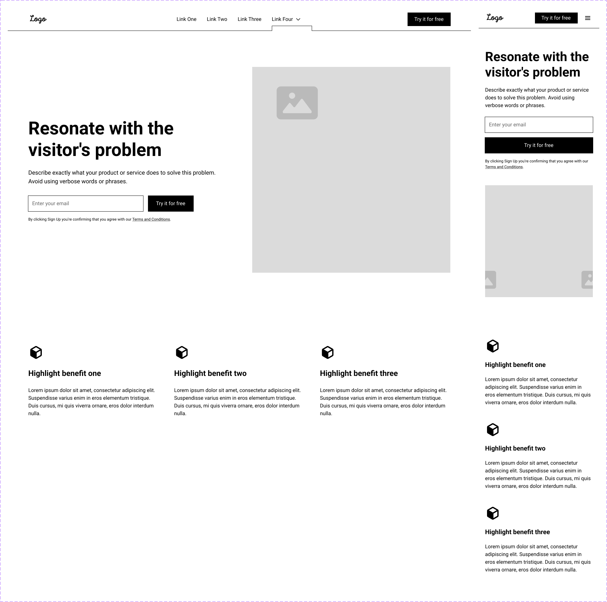

<h1 align="center"> Relume Kit Figma </h1>

Projeto em React, do Relume Kit do Figma - Home Page 3.

  <a href="#-tecnologias">Tecnologias</a>&nbsp;&nbsp;&nbsp;|&nbsp;&nbsp;&nbsp;
  <a href="#-projeto">Projeto</a>&nbsp;&nbsp;&nbsp;|&nbsp;&nbsp;&nbsp;
  <a href="#-layout">Layout</a>&nbsp;&nbsp;&nbsp;

 

  

## 🚀 Tecnologias

Esse projeto foi desenvolvido com as seguintes tecnologias:

- HTML e CSS
- JavaScript
- React.Js
- Git e Github
- Figma

## 💻 Projeto

O projeto é uma landingpage (home page) do Kit da Relume no Figma - Modelo de Home 3.

## 🔖 Layout

Você pode visualizar o layout do projeto através [DESSE LINK](https://www.figma.com/design/6ZsLHXlMT4aY2BJwaLg1SN/Relume-Figma-Kit-(v2.6)-(Community)?node-id=2006-7&t=VSTayFJgHyqQUGv6-1). É necessário ter conta no [Figma](https://figma.com) para acessá-lo.
